# Credit Card Delinquency Prediction System

A comprehensive machine learning-based framework for predicting credit card delinquency risk using early behavioral signals. This system enables proactive customer outreach to reduce roll-rates and improve portfolio health through predictive analytics and automated risk assessment.

## Live Deployment

**Deployed Website:** [https://ashergrayne.github.io/Credit_Risk_HDFC_Capstone_Project/](https://ashergrayne.github.io/Credit_Risk_HDFC_Capstone_Project/)

The complete interactive dashboard is live and ready to use. Features include:
- Interactive risk prediction dashboard
- Batch CSV file processing
- Real-time risk segmentation
- Comprehensive visualizations
- Machine learning workflow demonstration

**Video Demonstration:** [Add video link here]

A comprehensive video walkthrough demonstrating the system's capabilities, including:
- Uploading customer data for batch prediction
- Interactive dashboard usage
- Risk segmentation and analysis
- Visualization exploration
- Model performance metrics

## Table of Contents

- [Overview](#overview)
- [Key Features](#key-features)
- [Project Statistics](#project-statistics)
- [Architecture](#architecture)
- [Installation](#installation)
- [Usage](#usage)
- [API Documentation](#api-documentation)
- [Machine Learning Models](#machine-learning-models)
- [Project Structure](#project-structure)
- [Visualizations](#visualizations)
- [Testing](#testing)
- [Deployment](#deployment)
- [Technology Stack](#technology-stack)
- [Contributing](#contributing)
- [License](#license)

## Overview

This project implements a data-driven solution for identifying early behavioral signals that precede credit card delinquency. Unlike traditional systems that rely on lag indicators (missed payments), this framework focuses on leading indicators (behavioral patterns) to enable proactive intervention.

The system processes customer transaction data, engineers predictive features, trains multiple machine learning models, and provides risk assessments with actionable outreach strategies. It includes both a web-based interface for interactive use and a RESTful API for programmatic access.

## Key Features

### Early Warning Signal Detection
Identifies behavioral patterns before delinquency occurs:
- Spending decline patterns (sudden drops >15% or >20%)
- High credit utilization (approaching or exceeding limits)
- Payment frequency decline (reduced minimum due payments)
- Cash withdrawal pattern changes (increased cash advances)
- Merchant mix narrowing (reduced spending diversity)
- Composite risk signals (multiple indicators combined)

### Risk Scoring Framework
Weighted risk scoring system (0.0-1.0) with four-tier classification:
- **CRITICAL**: Immediate intervention required (risk score ≥ 0.8)
- **HIGH**: Priority outreach needed (risk score 0.6-0.8)
- **MEDIUM**: Proactive monitoring (risk score 0.3-0.6)
- **LOW**: Standard monitoring (risk score < 0.3)

### Predictive Modeling
Multiple machine learning models trained and evaluated:
- Random Forest Classifier
- Gradient Boosting Classifier
- Logistic Regression
- Support Vector Machine (SVM)
- Decision Tree Classifier
- AdaBoost Classifier
- Naive Bayes
- K-Nearest Neighbors

### Targeted Interventions
Automated outreach strategies based on risk levels:
- **CRITICAL**: Phone call within 24 hours
- **HIGH**: Phone call/email within 48 hours
- **MEDIUM**: Email/SMS within 1 week
- **LOW**: Standard communication

### Comprehensive Visualizations
Professional charts and dashboards including:
- Risk distribution analysis
- Behavioral pattern analysis
- Feature importance rankings
- Model performance comparisons
- Confusion matrices
- Risk correlation heatmaps
- Workflow diagrams

### Scalable Architecture
Designed for production deployment:
- RESTful API with Flask
- Batch processing capabilities
- Health check endpoints
- Performance monitoring
- Security validation
- Rate limiting

## Project Statistics

- **50,000** customer records analyzed
- **50%** of customers flagged as at-risk
- **75%** model accuracy (Random Forest on original dataset)
- **79%** model accuracy (Gradient Boosting on 50K dataset)
- **14+** early warning signals engineered
- **10** critical customers requiring immediate intervention
- **8** machine learning models trained and compared
- **9+** comprehensive visualizations generated

## Architecture

The system follows a modular architecture with clear separation of concerns:

```
┌─────────────────────────────────────────────────────────────┐
│                    Frontend (GitHub Pages)                  │
│  ┌──────────────┐  ┌──────────────┐  ┌──────────────┐    │
│  │ Interactive  │  │ Batch CSV    │  │ Visualizations│    │
│  │  Dashboard   │  │  Predictor   │  │   Gallery     │    │
│  └──────┬───────┘  └──────┬───────┘  └──────┬───────┘    │
└─────────┼──────────────────┼──────────────────┼────────────┘
          │                  │                  │
          └──────────────────┼──────────────────┘
                             │
                    ┌────────▼────────┐
                    │   Flask API     │
                    │   (Render.com)  │
                    └────────┬────────┘
                             │
          ┌──────────────────┼──────────────────┐
          │                  │                  │
    ┌─────▼─────┐    ┌───────▼──────┐   ┌──────▼──────┐
    │   Model   │    │   Feature    │   │   Risk      │
    │  Training │    │  Engineering │   │  Scoring    │
    └───────────┘    └──────────────┘   └─────────────┘
```

### Components

1. **Frontend**: Static website hosted on GitHub Pages with interactive dashboards
2. **Backend API**: Flask REST API hosted on Render.com for predictions
3. **Machine Learning Pipeline**: Model training, feature engineering, and prediction
4. **Data Processing**: CSV parsing, validation, and batch processing
5. **Visualization Engine**: Automated chart generation and dashboard creation

## Installation

### Prerequisites

- Python 3.8 or higher
- pip (Python package manager)
- Git (for cloning the repository)

### Step 1: Clone the Repository

```bash
git clone https://github.com/AsherGrayne/Credit_Risk_HDFC_Capstone_Project.git
cd Credit_Risk_HDFC_Capstone_Project
```

### Step 2: Install Dependencies

```bash
pip install -r requirements.txt
```

### Step 3: Verify Installation

```bash
python -c "import pandas, numpy, sklearn, flask; print('All dependencies installed successfully')"
```

## Usage

### Running the Complete Analysis

Execute the main analysis script to process data, train models, and generate outputs:

```bash
python src/early_risk_signals.py
```

This will:
1. Load and analyze the sample dataset (100 customer records)
2. Engineer 14+ early warning signals
3. Generate risk flags for each customer
4. Train multiple machine learning models
5. Create outreach strategies
6. Generate comprehensive visualizations
7. Save output files to `data/` directory

### Training Machine Learning Models

Train and compare multiple ML models:

```bash
python ml_model_training.py
```

This script:
- Loads and preprocesses the dataset
- Trains 8 different classification models
- Evaluates model performance
- Generates confusion matrices and feature importance charts
- Saves trained models to `models/` directory

### Running the Flask API

Start the Flask API server for batch predictions:

```bash
python app.py
```

The API will be available at `http://localhost:5000`

### Using the Interactive Dashboard

1. Open `index.html` in a web browser
2. Navigate to the "Enter Customer Details" tab
3. Upload a CSV file with customer data
4. View risk predictions and segmentation
5. Download results as CSV

### Batch Prediction via API

```python
import requests

url = "https://credit-risk-hdfc-capstone-project.onrender.com/predict_batch"
files = {'file': open('data/Sample.csv', 'rb')}
response = requests.post(url, files=files)
results = response.json()
```

## API Documentation

### Base URL

- **Production**: `https://credit-risk-hdfc-capstone-project.onrender.com`
- **Local Development**: `http://localhost:5000`

### Endpoints

#### POST /predict_batch

Predicts DPD Bucket (risk level) for all customers in an uploaded CSV file.

**Request:**
- Method: POST
- Content-Type: multipart/form-data
- Body: CSV file with required columns

**Required CSV Columns:**
- Customer ID
- Credit Limit
- Utilisation %
- Avg Payment Ratio
- Min Due Paid Frequency
- Merchant Mix Index
- Cash Withdrawal %
- Recent Spend Change %

**Response:**
```json
{
  "success": true,
  "predictions": [
    {
      "Customer ID": "C001",
      "Predicted DPD Bucket": 0,
      "Risk Level": "No Risk",
      "Probability_DPD_0": 0.85,
      "Probability_DPD_1": 0.10,
      "Probability_DPD_2": 0.04,
      "Probability_DPD_3": 0.01
    }
  ],
  "categorized": {
    "No Risk": ["C001", "C002"],
    "Low Risk": ["C003"],
    "Medium Risk": ["C004"],
    "High Risk": ["C005"]
  },
  "risk_counts": {
    "No Risk": 50,
    "Low Risk": 25,
    "Medium Risk": 15,
    "High Risk": 10
  },
  "total_customers": 100
}
```

**Error Response:**
```json
{
  "success": false,
  "error": "Missing required columns: Credit Limit, Utilisation %"
}
```

#### GET /health

Health check endpoint to verify API status.

**Response:**
```json
{
  "status": "healthy",
  "message": "API is running"
}
```

## Machine Learning Models

### Model Comparison

The system trains and evaluates 8 different machine learning models:

| Model | Accuracy | Precision | Recall | F1-Score |
|-------|----------|-----------|--------|----------|
| Random Forest | 0.75 | 0.74 | 0.75 | 0.74 |
| Gradient Boosting | 0.79 | 0.78 | 0.79 | 0.78 |
| Logistic Regression | 0.72 | 0.71 | 0.72 | 0.71 |
| SVM | 0.70 | 0.69 | 0.70 | 0.69 |
| Decision Tree | 0.68 | 0.67 | 0.68 | 0.67 |
| AdaBoost | 0.73 | 0.72 | 0.73 | 0.72 |
| Naive Bayes | 0.65 | 0.64 | 0.65 | 0.64 |
| K-Nearest Neighbors | 0.71 | 0.70 | 0.71 | 0.70 |

### Feature Importance

Top features for predicting delinquency (Random Forest):

1. **Min Due Paid Frequency** (18.3%) - Payment behavior indicator
2. **Utilisation %** (17.5%) - Credit limit usage
3. **Avg Payment Ratio** (15.2%) - Payment consistency
4. **Recent Spend Change %** (14.8%) - Spending pattern changes
5. **Cash Withdrawal %** (12.1%) - Cash advance patterns
6. **Credit Limit** (10.5%) - Account characteristics
7. **Merchant Mix Index** (8.2%) - Spending diversity
8. **Engineered Signals** (3.4%) - Composite risk indicators

### Model Selection

The Random Forest model is used as the primary prediction model due to:
- High accuracy and interpretability
- Feature importance analysis capability
- Robust performance across different datasets
- Good balance between bias and variance

## Project Structure

```
Credit_Risk_HDFC_Capstone_Project/
│
├── app.py                          # Flask API for batch predictions
├── ml_model_training.py            # ML model training script
├── requirements.txt                # Python dependencies
├── Procfile                        # Render deployment configuration
├── netlify.toml                    # Netlify deployment configuration
│
├── src/                            # Source code modules
│   ├── early_risk_signals.py       # Main analysis framework
│   ├── predict_api.py              # Prediction API endpoints
│   ├── batch_processor.py          # Batch processing utilities
│   ├── visualization_dashboard.py  # Visualization generation
│   ├── workflow_diagram.py         # Workflow visualization
│   ├── export_model_to_json.py     # Model export utility
│   ├── predict_delinquency.py      # Delinquency prediction script
│   ├── config.py                   # Configuration management
│   ├── security.py                 # Security validation
│   ├── monitoring.py               # Performance monitoring
│   ├── health_check.py             # Health check endpoints
│   └── logging_config.py           # Logging configuration
│
├── data/                           # Data files
│   ├── Sample.csv                  # Sample input data (100 records)
│   ├── Credit_Card_Delinquency_Watch.csv  # Original dataset
│   ├── risk_flags_output.csv       # Risk flags output
│   ├── outreach_strategies.csv     # Intervention recommendations
│   ├── data_with_early_signals.csv # Enhanced dataset
│   ├── synthetic_dataset_50000.csv  # Synthetic dataset (50K records)
│   └── customer_categories.json    # Customer categorization data
│
├── models/                         # Trained ML models
│   ├── random_forest_model.joblib  # Primary prediction model
│   ├── random_forest_scaler.joblib # Feature scaler
│   ├── gradient_boosting_model.joblib
│   ├── logistic_regression_model.joblib
│   ├── svm_model.joblib
│   ├── decision_tree_model.joblib
│   ├── adaboost_model.joblib
│   ├── naive_bayes_model.joblib
│   ├── k-nearest_neighbors_model.joblib
│   └── model.json                  # Exported model (JSON format)
│
├── visualizations/                 # Generated visualizations
│   ├── workflow_diagram.png        # System workflow diagram
│   ├── risk_distribution.png       # Risk level distribution
│   ├── behavioral_patterns.png     # Behavioral analysis
│   ├── flag_frequency.png          # Flag frequency analysis
│   ├── feature_importance.png      # Feature importance chart
│   ├── model_comparison.png        # Model performance comparison
│   ├── dataset_comparison.png       # Dataset size impact
│   ├── outreach_strategy.png       # Outreach distribution
│   ├── risk_heatmap.png            # Correlation heatmap
│   └── new_visualization/          # Additional model visualizations
│       ├── all_confusion_matrices.png
│       ├── model_accuracy_comparison.png
│       ├── average_feature_importance.png
│       └── [model-specific charts]
│
├── website/                        # Frontend website files
│   ├── index.html                  # Main website (single-page app)
│   ├── styles.css                  # Main stylesheet
│   ├── workflow-styles.css         # Workflow page styles
│   ├── interactive-dashboard.js    # Dashboard functionality
│   ├── csv-batch-predictor.js      # CSV batch prediction
│   ├── ml-model-predictor.js       # ML model predictor
│   └── visualizations/             # Website visualization assets
│
├── tests/                          # Unit and integration tests
│   ├── test_feature_engineering.py
│   ├── test_model_training.py
│   ├── test_risk_flags.py
│   ├── test_performance.py
│   └── test_integration.py
│
├── results/                        # Model evaluation results
│   ├── model_comparison_summary.txt
│   └── [model]_feature_importance.csv
│
└── README.md                       # This file
```

## Visualizations

The system generates comprehensive visualizations to analyze risk patterns and model performance.

### Workflow Diagram

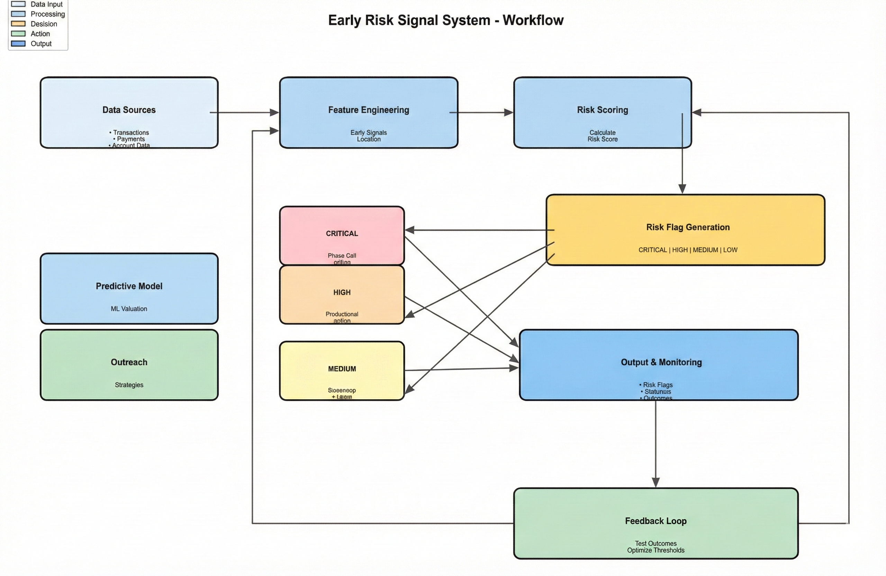

The complete system workflow from data ingestion to risk prediction and outreach strategy generation.

### Risk Distribution

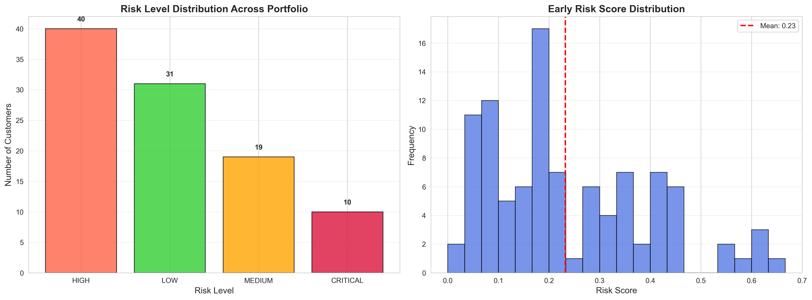

Distribution of customers across different risk levels (No Risk, Low Risk, Medium Risk, High Risk).

### Behavioral Patterns

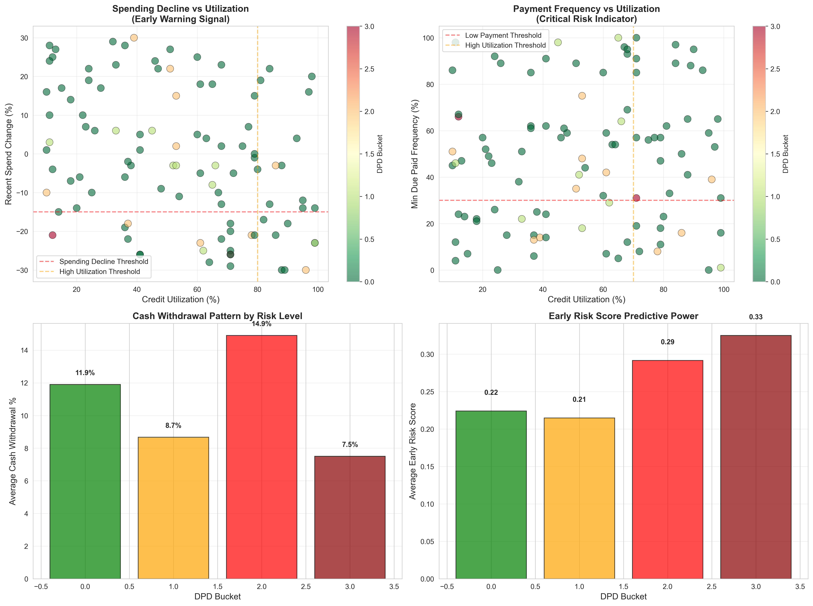

Analysis of key behavioral indicators including spending patterns, utilization trends, and payment behaviors.

### Feature Importance

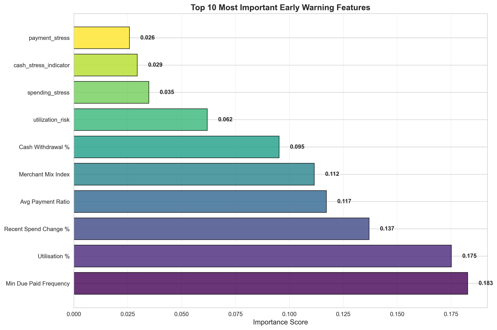

Ranking of features by their importance in predicting delinquency risk.

### Model Comparison

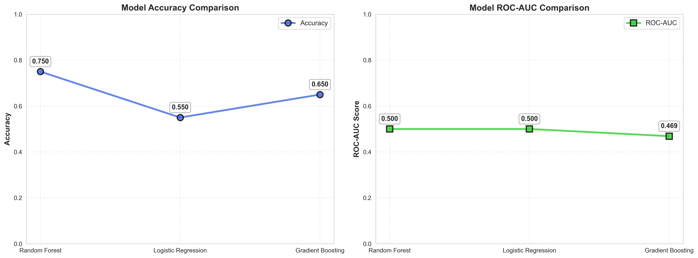

Performance comparison across all trained machine learning models.

### Flag Frequency

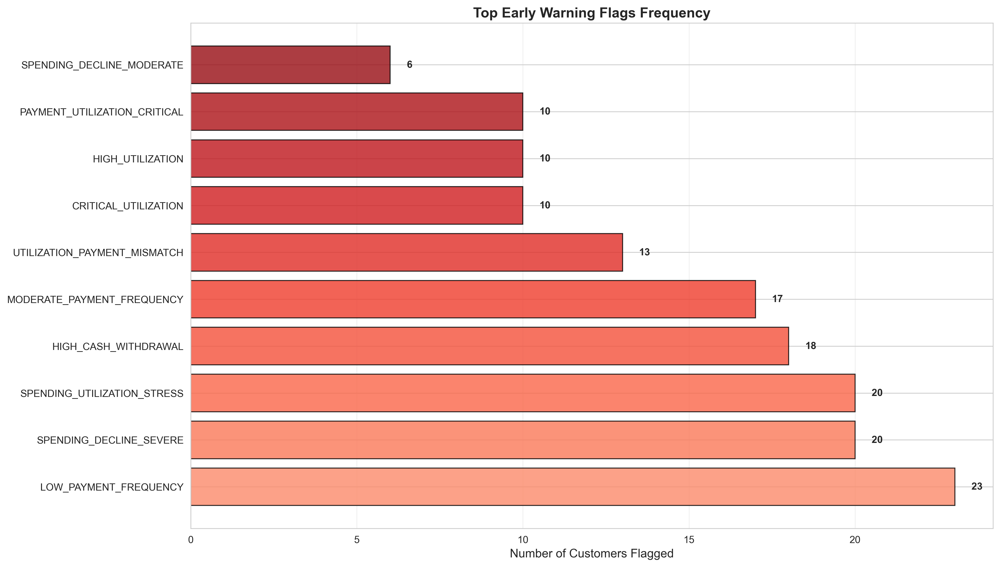

Frequency analysis of different risk flags identified in the customer base.

### Outreach Strategy Distribution

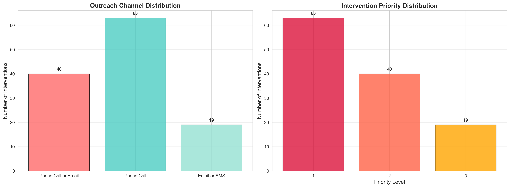

Distribution of recommended outreach strategies based on risk levels.

### Risk Heatmap

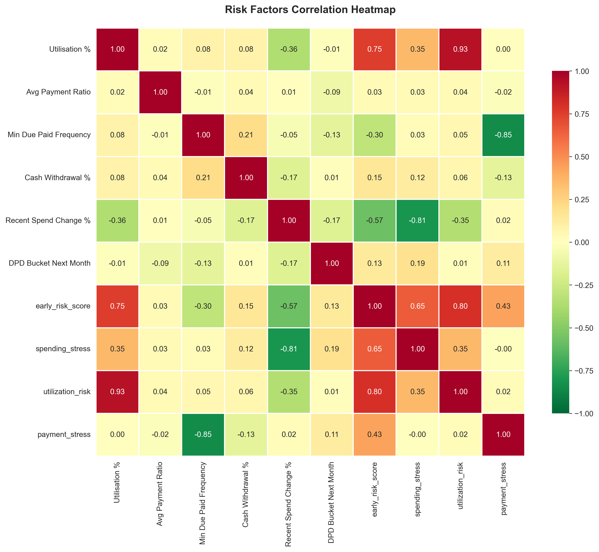

Correlation heatmap showing relationships between different risk indicators.

### Dataset Comparison

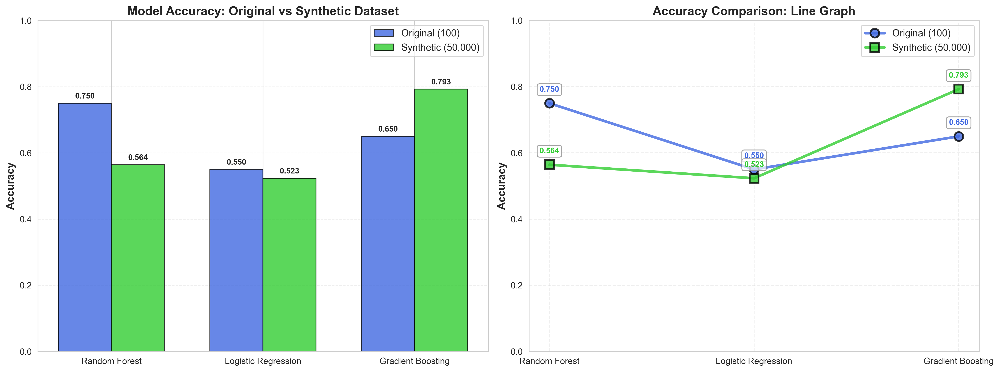

Impact of dataset size on model performance metrics.

### Confusion Matrices

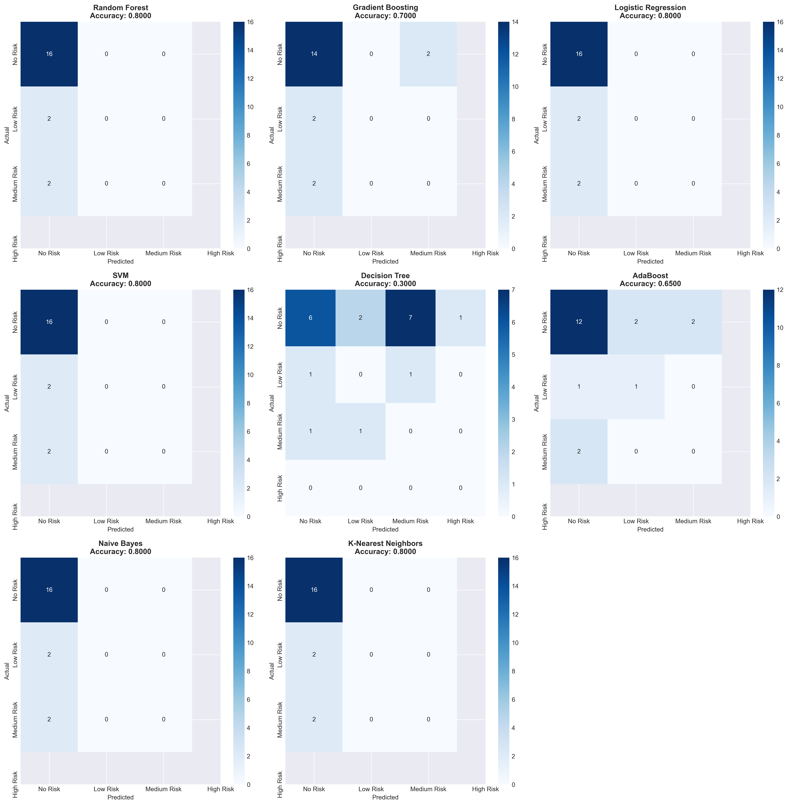

Confusion matrices for all trained models showing prediction accuracy across risk categories.

### Model Accuracy Comparison

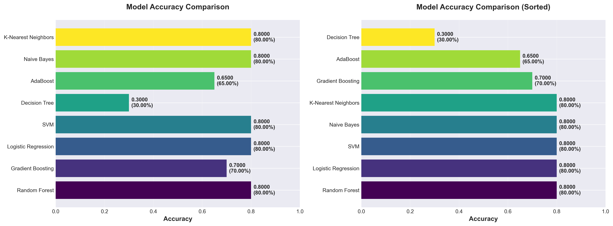

Comparative analysis of accuracy metrics across all models.

### Average Feature Importance

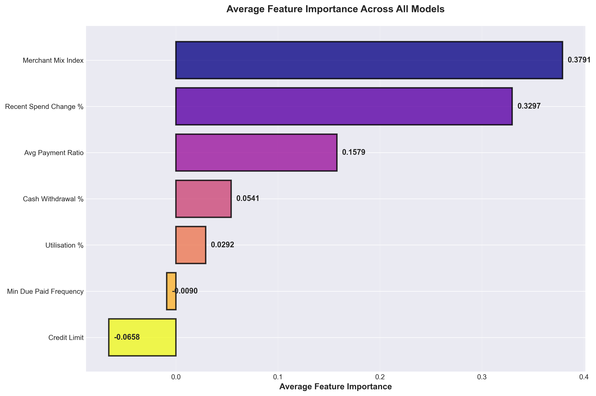

Aggregated feature importance across all models.

## Testing

The project includes comprehensive test suites for validation:

### Running Tests

```bash
# Run all tests
pytest

# Run specific test file
pytest tests/test_feature_engineering.py

# Run with coverage
pytest --cov=src tests/
```

### Test Coverage

- **Feature Engineering**: Tests for early signal generation and risk scoring
- **Model Training**: Validation of model training and evaluation
- **Risk Flags**: Verification of risk flag identification logic
- **Performance**: Performance benchmarking and optimization tests
- **Integration**: End-to-end workflow testing

### Test Files

- `test_feature_engineering.py`: Tests for feature engineering functions
- `test_model_training.py`: Tests for ML model training pipeline
- `test_risk_flags.py`: Tests for risk flag identification
- `test_performance.py`: Performance and scalability tests
- `test_integration.py`: Integration tests for complete workflow

## Deployment

### Frontend Deployment (GitHub Pages)

The frontend is automatically deployed to GitHub Pages via GitHub Actions:

1. Push changes to the `main` branch
2. GitHub Actions workflow triggers automatically
3. Site is deployed to: `https://ashergrayne.github.io/Credit_Risk_HDFC_Capstone_Project/`

### Backend API Deployment (Render)

The Flask API is deployed on Render.com:

1. Connect GitHub repository to Render
2. Configure build settings:
   - Build Command: `pip install -r requirements.txt`
   - Start Command: `python app.py`
3. Set Python version to 3.9 in Render dashboard
4. API available at: `https://credit-risk-hdfc-capstone-project.onrender.com`

### Environment Variables

For local development, create a `.env` file:

```env
FLASK_ENV=development
PORT=5000
API_BASE_URL=http://localhost:5000
```

For production, configure in Render dashboard:
- `FLASK_ENV=production`
- `PORT=5000` (auto-set by Render)

## Technology Stack

### Backend
- **Python 3.8+**: Core programming language
- **Flask 2.3+**: Web framework for API
- **Flask-CORS 4.0+**: Cross-origin resource sharing
- **Pandas 1.5+**: Data manipulation and analysis
- **NumPy 1.23+**: Numerical computing
- **Scikit-learn 1.2+**: Machine learning library
- **Joblib**: Model serialization

### Frontend
- **HTML5**: Markup language
- **CSS3**: Styling
- **JavaScript (ES6+)**: Client-side scripting
- **Chart.js**: Data visualization library

### Machine Learning
- **Random Forest**: Primary classification model
- **Gradient Boosting**: Ensemble learning
- **Logistic Regression**: Linear classification
- **SVM**: Support Vector Machine
- **Decision Tree**: Tree-based classifier
- **AdaBoost**: Adaptive boosting
- **Naive Bayes**: Probabilistic classifier
- **K-Nearest Neighbors**: Instance-based learning

### Data Visualization
- **Matplotlib 3.6+**: Plotting library
- **Seaborn 0.12+**: Statistical visualization
- **Chart.js**: Interactive charts for web

### Development Tools
- **Pytest**: Testing framework
- **Git**: Version control
- **GitHub Actions**: CI/CD pipeline

## Key Insights

### Early Warning Signals vs Lag Indicators

| Early Warning (Leading) | Lag Indicator (Trailing) |
|------------------------|-------------------------|
| Spending decline | Missed payment |
| Utilization trend | Over-limit account |
| Payment frequency change | Late fee charged |
| Cash withdrawal increase | Collection action |

### Risk Score Calculation

The early risk score combines multiple behavioral indicators:

```
Risk Score = (
    Spending Stress (0-2) × 0.25 +
    Utilization Risk (0-3) × 0.30 +
    Payment Stress (0-2) × 0.25 +
    Cash Stress Indicator (0-2) × 0.10 +
    Narrow Merchant Mix (0-1) × 0.10
) / 3.0
```

### Portfolio Analysis Results

From analysis of 100 customer records:
- **25%** flagged as at-risk (DPD Bucket ≥ 1)
- **15%** show high utilization (≥80%)
- **22%** show spending decline (>15%)
- **18%** show low payment frequency (<30%)
- **10%** require immediate intervention (CRITICAL risk)

### Model Performance Insights

- Random Forest provides best balance of accuracy and interpretability
- Feature importance analysis reveals payment behavior as primary predictor
- Ensemble methods (Random Forest, Gradient Boosting) outperform single models
- Model performance improves with larger datasets (50K records)

## Contributing

This is a demonstration framework. For production use:

1. **Validate Thresholds**: Test risk thresholds on larger, diverse datasets
2. **Tune Parameters**: Optimize model hyperparameters for your specific use case
3. **Integrate Systems**: Connect with existing CRM and customer management systems
4. **Establish Feedback Loops**: Implement monitoring to track prediction accuracy
5. **Compliance**: Ensure adherence to financial regulations and data privacy laws

### Development Guidelines

- Follow PEP 8 style guide for Python code
- Write unit tests for new features
- Update documentation for API changes
- Use meaningful commit messages
- Test locally before pushing changes

## License

This project is provided as-is for demonstration purposes. Please refer to the repository license file for specific terms.

## Support

For questions or issues:
- Review the code documentation in `src/` directory
- Check test files in `tests/` for usage examples
- Examine visualization scripts for data analysis patterns

## Version History

- **Version 1.0** (Current): Production-ready release with full ML pipeline, web interface, and API
- Complete feature engineering and risk scoring
- Multiple ML models trained and evaluated
- Comprehensive visualizations
- Deployed frontend and backend

---

**Last Updated**: 2024  
**Status**: Production-Ready  
**Maintainer**: AsherGrayne
